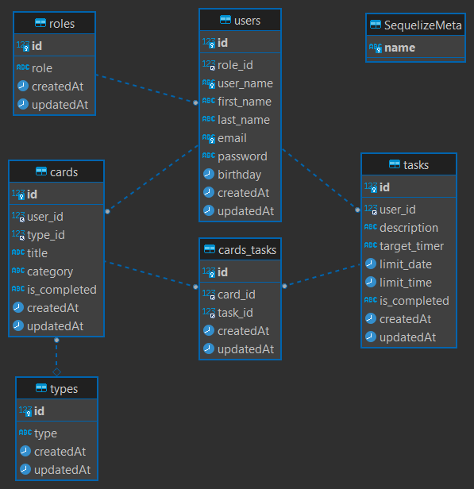

# Bienvenido a mi app backend

<details>
  <summary>Contenido 📝</summary>
  <ol>
    <li><a href="#objetivo">Objetivo</a></li>
    <li><a href="#sobre-el-proyecto">Sobre el proyecto</a></li>
    <!-- <li><a href="#deploy-🌟">Deploy</a></li> -->
    <li><a href="#stack">Stack</a></li>
    <li><a href="#diagrama-bd">Diagrama</a></li>
    <li><a href="#instalación-en-local">Instalación</a></li>
    <li><a href="#endpoints">Endpoints</a></li>
    <!-- <li><a href="#futuras-funcionalidades">Futuras funcionalidades</a></li> -->
    <!-- <li><a href="#licencia">Licencia</a></li> -->
    <li><a href="#webgrafia">Webgrafia</a></li>
    <!-- <li><a href="#desarrollo">Desarrollo</a></li> -->
    <li><a href="#contacto">Contacto</a></li>
  </ol>
</details>

## Objetivo

Este proyecto requería realizar una base de datos con MySQL, Express y Sequelize. Además, debe contar con una relación de uno a muchos y otra de muchos a muchos como mínimo.

## Sobre el proyecto

Se trata de una app tipo To Do List en la que el usuario puede registrarse y crear tarjetas con tareas, para organizar sus cosas a hacer. Las tareas pueden tener una fecha y hora objetivos, se pueden marcar o desmarcar como completadas. 

<!-- ## Deploy 🌟

<div align="center">
    ⭐🌟⭐<a href=""><strong>Url a producción </strong></a>⭐🌟⭐
</div> -->

## Stack

Tecnologías utilizadas:

<div align="center">
<a href="https://www.expressjs.com/">
    
</a>
<a href="https://sequelize.org/">
    
</a>
<a href="https://nodejs.org/es/">
    
</a>
<a href="https://developer.mozilla.org/es/docs/Web/JavaScript">
    
</a>
 </div>

## Diagrama BD



## Instalación en local

1. Clonar el repositorio
2. `$ npm install`
3. Conectamos nuestro repositorio con la base de datos
4. `$ Ejecutamos las migraciones`
5. `$ Ejecutamos los seeders`
6. `$ npm run dev`

## Endpoints

<details>
<summary>Endpoints</summary>

- AUTH

    - REGISTER

          POST http://localhost:3000/auth/register/

    body:

    ```js
        {
            "user_name": "Nuevo",
            "email": "nuevo@usuario.com",
            "password": "12345678"
        }
    ```

    - LOGIN

          POST http://localhost:3000/auth/login/

    body:

    ```js
        {
            "email": "nuevo@usuario.com",
            "password": "12345678"
        }
    ```

- USERS 

    - GET ALL USERS 

              GET http://localhost:3000/users?page=1

    - GET MY PROFILE

              GET http://localhost:3000/users/profile
 
    - UPDATE MY PROFILE

              POST http://localhost:3000/users/update-profile

                   

    body: 

     ```js
        {
            "user_name": "username34",
            "first_name": "New",
            "last_name": "User",
            "email": "new@user.com",
            "birthday": "2000-01-01"
    
        }
    ```

    - GET MY CARDS TASKS

              GET http://localhost:3000/users/user-cards-tasks

    - CREATE CARD

              POST http://localhost:3000/users/create-card

                   

       body: 

     ```js
        {
            "title": "this is a card",
           
        }
    ```
   
    - UPDATE CARD

              POST http://localhost:3000/users/update-card/{card id}

                   

       body: 

     ```js
        {
            "title": "this is still a card" ,

        }
    ```
    - CREATE TASK

              POST http://localhost:3000/users/create-task/{card id}

                   

       body: 

     ```js
        {
            "description": "this is your task",
            "target_timer": "yes",
            "limit_date": "2023-12-31",
            "limit_time": "20:00",
            "is_completed": "no"
        }
    ```
   
    - UPDATE TASK

              POST http://localhost:3000/users/update-task/{task id}

                   

       body: 

     ```js
        {
            "description": "this is still your task",
            "target_timer": "yes",
            "limit_date": "2023-12-24",
            "limit_time": "15:00",
            "is_completed": "no"

        }
    ```
    - DELETE CARD

              DEL http://localhost:3000/users/delete-card/{card id}              
    
    - DELETE TASK

              DEL http://localhost:3000/users/delete-task/{task id}              

   

                   

  </details>

<!-- ## Futuras funcionalidades

[ ] Añadir entradas de diario a las tarjetas -->

<!-- ## Licencia

Este proyecto se encuentra bajo licencia de "Mi Nombre" -->

## Webgrafia:

Para conseguir mi objetivo he recopilado información de:

- https://developer.mozilla.org/en-US/
- https://www.w3schools.com/js/default.asp
- https://sequelize.org/docs/v6/getting-started/

<!-- ## Desarrollo:

```js
const developer = "datata";

console.log("Desarrollado por: " + datata);
``` -->

## Contacto

<a href = "mailto:adrianapardo1998@gmail.com"></a>
<a href="https://www.linkedin.com/in/adriana-pardo-diez/" target="_blank"></a>

</p>
